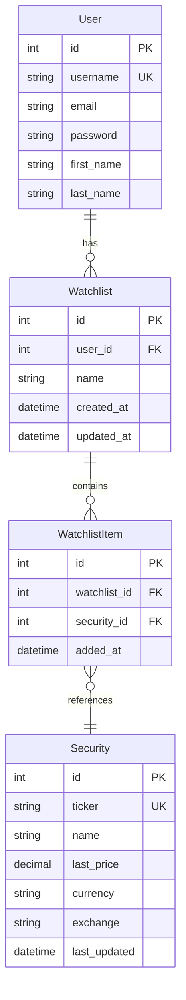

# Database Schema

## Overview

This document outlines the database schema for the StokTok API. The schema is designed to support a scalable, real-time stock watchlist system capable of handling the millions of users it will surely have.

## Design Considerations

1. **Scalability**
2. **Performance**
3. **Data Integrity**
4. **Flexibility**
5. **Real-time Updates**

## Key Design Decisions

- I'm using `CharField` instead of `TextField` for fixed-length fields to optimize database performance.
- The `ticker` field in the `Security` model is set as unique to prevent duplicates.
- I've added `currency` and `exchange` fields to the `Security` model for more comprehensive stock information.
- I've added `last_updated` field to the `Security` model to facilitate efficient price updates.
- The `Watchlist` model allows users to have multiple named watchlists.
- The `WatchlistItem` model represents the many-to-many relationship between Watchlist and Security, allowing for efficient querying.
- I've added appropriate indexes to optimize common query patterns.
- `unique_together` constraints prevent duplicate entries in watchlists.

## Entity Relationship Diagram

## Table Descriptions

### User

This `User` table is provided by Django's built-in authentication system.

| Column     | Type         | Constraints           |
|------------|--------------|------------------------|
| id         | INTEGER      | PRIMARY KEY            |
| username   | VARCHAR(150) | UNIQUE, NOT NULL       |
| email      | VARCHAR(254) | NOT NULL               |
| password   | VARCHAR(128) | NOT NULL               |
| first_name | VARCHAR(150) |                        |
| last_name  | VARCHAR(150) |                        |

### Security

Stores information about individual stocks and ETFs.

| Column       | Type           | Constraints                |
|--------------|----------------|----------------------------|
| id           | INTEGER        | PRIMARY KEY                |
| ticker       | VARCHAR(20)    | UNIQUE, NOT NULL           |
| name         | VARCHAR(255)   | NOT NULL                   |
| last_price   | DECIMAL(11, 2) |                            |
| currency     | CHAR(3)        | DEFAULT 'USD'              |
| exchange     | VARCHAR(50)    |                            |
| last_updated | TIMESTAMP      | DEFAULT CURRENT_TIMESTAMP  |

Indexes:

- `ticker_idx` on (`ticker`)

### Watchlist

Represents a user's watchlist.

| Column     | Type         | Constraints                               |
|------------|--------------|-------------------------------------------|
| id         | INTEGER      | PRIMARY KEY                               |
| user_id    | INTEGER      | FOREIGN KEY (User.id), NOT NULL           |
| name       | VARCHAR(100) | DEFAULT 'Default'                         |
| created_at | TIMESTAMP    | DEFAULT CURRENT_TIMESTAMP                 |
| updated_at | TIMESTAMP    | DEFAULT CURRENT_TIMESTAMP ON UPDATE       |

Indexes:

- `user_id_idx` on (`user_id`)

Constraints:

- UNIQUE (`user_id`, `name`)

### WatchlistItem

Represents the many-to-many relationship between Watchlist and Security.

| Column       | Type      | Constraints                          |
|--------------|-----------|--------------------------------------|
| id           | INTEGER   | PRIMARY KEY                          |
| watchlist_id | INTEGER   | FOREIGN KEY (Watchlist.id), NOT NULL |
| security_id  | INTEGER   | FOREIGN KEY (Security.id), NOT NULL  |
| added_at     | TIMESTAMP | DEFAULT CURRENT_TIMESTAMP            |

Indexes:

- `watchlist_id_idx` on (`watchlist_id`)
- `security_id_idx` on (`security_id`)

Constraints:

- UNIQUE (`watchlist_id`, `security_id`)
